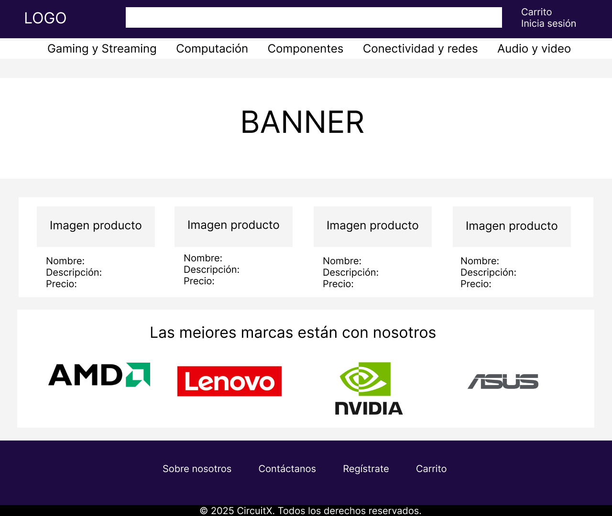
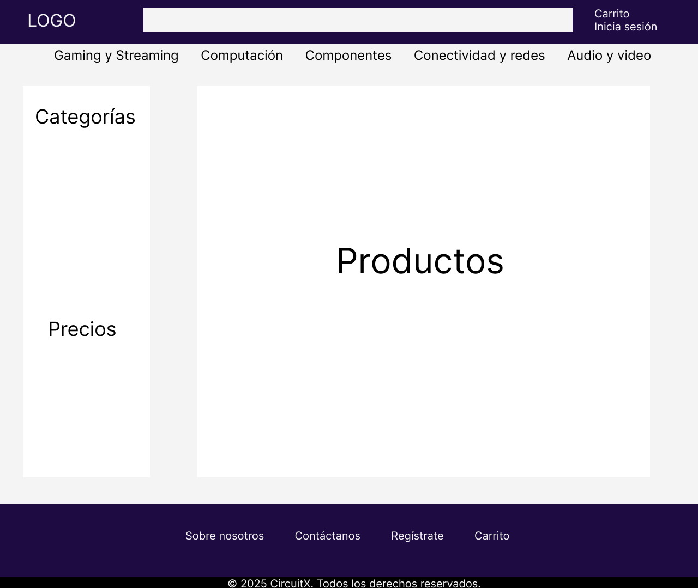
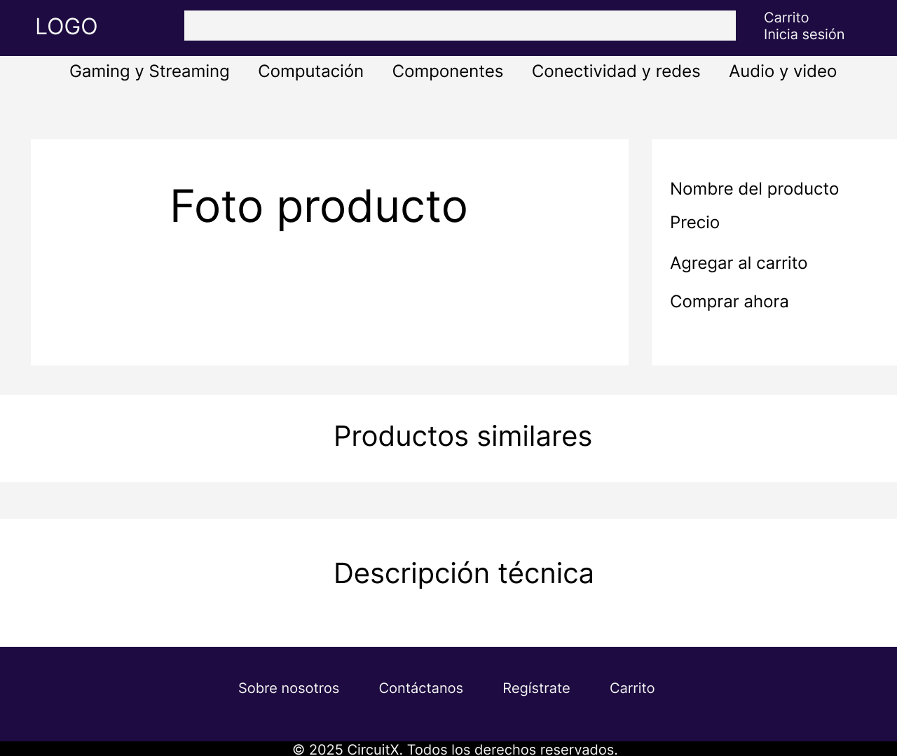

# 🛒 CircuitX — E-commerce de Productos Tecnológicos

Este proyecto es un **e-commerce completo**, desarrollado con el objetivo de construir una aplicación web realista, modular y bien estructurada.  
La tienda está pensada como un proyecto profesional de portafolio: implementa arquitectura frontend → API REST → backend → base de datos, siguiendo buenas prácticas y un flujo real de un sitio de compras.

---


## 🚀 Objetivos del Proyecto
- Construir un e-commerce funcional aplicando arquitectura real.
- Demostrar habilidades full stack: frontend, backend y base de datos.
- Implementar una API REST en PHP conectada a PostgreSQL.
- Practicar flujos típicos de sistemas reales (CRUD, carrito, vistas dinámicas).
- Servir como base para futuros proyectos más complejos.

---

## 🎯 Público Objetivo

**El sitio está dirigido a:**

* Jóvenes y adultos (18–45 años) interesados en tecnología.
* Personas que buscan productos informáticos como notebooks, componentes, periféricos y accesorios.
* Usuarios con conocimientos básicos de compra online.
* Personas que desean comparar productos fácilmente y realizar compras rápidas.
* Clientes que buscan una interfaz clara, simple y moderna sin elementos innecesarios.

**Necesidades principales del público:**

* Ver productos con información clara.
* Filtrar por categorías.
* Usabilidad sencilla.
* Carrito de compras entendible.
* Proceso de login/registro rápido.
---

## 📌 Alcance del Proyecto (Scope)

**✔ Funcionalidades incluidas:**

* Catálogo de productos con categorías.
* Página de detalle de cada producto.
* Carrito de compras (agregar, quitar, ver total).

**Sistema de usuarios:**

* Registro
* Login
* Logout
* Panel de administración:
* Login de administrador
* CRUD de productos (crear, editar, eliminar)
* Gestión básica de categorías
* API REST en PHP para comunicación frontend → backend.
* Base de datos en PostgreSQL.

**❌ Funcionalidades que NO están incluidas (fuera del alcance):**

* Procesadores de pago reales (PayPal, WebPay, Stripe).
* Sistema de envíos reales.
* Historial de compras.
* Seguridad avanzada (tokens JWT, OAuth).
* Frontend con frameworks SPA (React, Vue, Angular).
* Panel multiusuario complejo.
---

## 🧰 Tecnologías Utilizadas

### **Frontend**
- HTML5  
- CSS3  
- Bootstrap 5  
- JavaScript (DOM + Fetch API)

### **Backend**
- PHP (API REST)
- PDO para la conexión segura a la base de datos

### **Base de Datos**
- PostgreSQL

### **Herramientas**
- Git + GitHub

---

## 🗺️ Sitemap del Proyecto

### **Usuarios (público)**  
- `/` — Página de inicio  
- `/productos` — Listado de productos  
- `/producto/{id}` — Detalle del producto  
- `/carrito` — Carrito de compras  
- `/contacto` — Información de contacto  
- `/sobre` — Acerca del sitio web

### **Administración**  
- `/admin/login` — Inicio de sesión admin  
- `/admin/panel` — Panel principal  
- `/admin/productos` — Gestión de productos  
- `/admin/productos/crear`  
- `/admin/productos/editar/{id}`  

---

## 📁 Estructura del Proyecto (en progreso)

```
/public
  index.html
  productos.html
  producto.html
  carrito.html
  contacto.html
  sobre.html
  /admin
    login.html
    panel.html
    productos.html
    productos-crear.html
    productos-editar.html
  /assets
    /css
      style.css
    /js
      app.js
    /img
/backend
  /api
    productos.php
    categorias.php
  /config
    database.php
  /sql
    schema.sql
``` 
## Definición de categorías

* Gaming y Streaming
* Computación
* Componentes
* Conectividad y redes
* Audio y video
---

## 🎨 Paleta de Colores del Proyecto

El e-commerce utiliza una paleta inspirada en tonos morados modernos. Esta paleta se emplea para dar una identidad visual limpia y profesional sin necesidad de un diseño complejo.

### Colores principales:

* Primario: #6e30e8
* Primario oscuro: #1d0b41

### Colores base:

* Blanco: #ffffff
* Fondo gris claro (opcional): #f4f4f4

### Variables CSS utilizadas:

```css
:root {
  --primary: #6e30e8;
  --primary-dark: #1d0b41;

  --bg: #ffffff;
  --bg-light: #f4f4f4;

  --text-dark: #1a1a1a;
  --text-light: #ffffff;

  --border-light: #e5e5e5;
}
```
---

## Wireframe

### Landing page



### Página de productos



### Página detalle de producto



## ⚙️ Estado del Proyecto
- [x] Definición de tecnologías  
- [x] Sitemap  
- [x] Documentación inicial (README)  
- [x] Definir los colores del sitio
- [ ] Estructura HTML  
- [ ] Base de datos  
- [ ] API REST  
- [ ] CRUD de productos  
- [ ] Carrito y vistas dinámicas  
- [ ] Panel administrador  

---

## 🛠️ Cómo Ejecutar el Proyecto (cuando esté completo)
1. Clonar este repositorio.  
2. Importar el archivo `/sql/schema.sql` en PostgreSQL.  
3. Configurar la conexión en `/config/database.php`.  
4. Ejecutar un servidor local de PHP: php -S localhost:8000 -t public

5. Abrir `http://localhost:8000` en el navegador.

---

## 📌 Notas del Desarrollo
Este proyecto será construido de forma incremental, comenzando por el **frontend** y luego avanzando hacia la base de datos, backend y API REST.  
El objetivo es que sea una simulación realista de un e-commerce moderno, aunque no será utilizado en producción.

---

## 👤 Autor
Proyecto desarrollado por **Javier-va32** como parte de un portafolio profesional.


